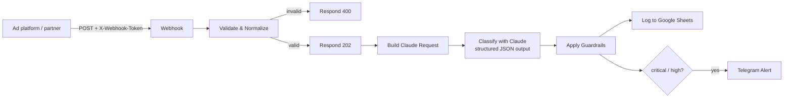

# Ad Account Health Monitor (n8n + Claude)

An n8n workflow that receives events about ad accounts (Meta, Google, TikTok…)
through a webhook, triages them with Claude, logs every event to Google Sheets
and sends a Telegram alert when something needs attention now.

Marketing teams run many ad accounts at once, often through partners that
provide the account infrastructure. A disabled account or a failed payment
stops ads straight away, and every hour without a reaction costs money. This
workflow collects those events in one place, ranks them by urgency and tells
the right person what to do next.

## How it works



1. **Webhook**: `POST /webhook/ad-account-events`. Every request needs the shared secret in the `X-Webhook-Token` header (n8n Header Auth).
2. **Validate & Normalize**: checks required fields and the platform, normalizes dates and builds a stable `event_id`. A bad payload gets `400` with a list of errors.
3. **Respond 202**: the sender gets an answer immediately, and processing continues after it.
4. **Classify with Claude**: Messages API with a JSON schema (structured output). Claude returns `severity`, `category`, `summary` and `recommended_action`. It retries 3 times. If the call still fails, the workflow keeps going.
5. **Apply Guardrails**: decides how far to trust the AI answer (see below).
6. **Google Sheets**: one row per event, as a log and audit trail.
7. **Telegram**: alert only for `critical` / `high`, so the channel doesn't become noise.

### Event format

```json
{
  "event_type": "account_disabled",
  "platform": "meta",
  "account_id": "act_1029384756",
  "account_name": "Brand US #3",
  "occurred_at": "2026-10-06T09:15:00Z",
  "event_id": "optional-id-from-partner",
  "details": { "reason": "UNUSUAL_ACTIVITY", "active_campaigns": 12 }
}
```

`platform` must be one of `meta`, `google`, `tiktok`, `snapchat` or `other`.

## AI with guardrails

Claude is good at reading messy partner messages and suggesting a next step.
The final decision, though, stays in code:

| Situation | What happens | `ai_status` |
|---|---|---|
| Valid answer, severity ≥ rule floor | AI answer is used | `ok` |
| AI rates a known critical event lower (e.g. `account_disabled` → `low`) | Severity is raised back to the floor | `overridden` |
| API error, timeout, refusal, cut-off output, answer outside the schema | Rule-based severity and action | `fallback` |

- **Severity floors per event type** (`src/guardrails.js`): `account_disabled` and `payment_failed` are always at least `critical`. The AI can raise severity but can never lower it below the floor.
- **Prompt injection.** `details` comes from outside, so the prompt tells Claude to treat it as data. Even if a message manages to talk the model down, the floor rule still holds. The `prompt_injection` test scenario covers this.
- **Traceability.** `ai_status` is written to every row, so you can see how often the AI was overridden or unavailable and tune the rules.

## Setup

### 1. Run n8n

```bash
docker compose up -d
# open http://localhost:5678
```

### 2. Import the workflow

In n8n: **Workflows → Import from File → `workflow/ad-account-monitor.json`**.

### 3. Credentials

| Node | Credential type | Settings |
|---|---|---|
| Webhook | Header Auth | Name: `X-Webhook-Token`, Value: any long random secret |
| Classify with Claude | Header Auth | Name: `x-api-key`, Value: your Anthropic API key |
| Log to Google Sheets | Google Sheets OAuth2 | Replace `REPLACE_WITH_GOOGLE_SHEET_URL` with your sheet URL |
| Telegram Alert | Telegram API | Bot token from @BotFather. Replace `REPLACE_WITH_TELEGRAM_CHAT_ID` |

The Google Sheet needs an `events` tab with these columns in row 1:

```
received_at, occurred_at, event_id, platform, account_id, account_name, event_type,
severity, category, summary, recommended_action, ai_status, details_json
```

The model is set in `src/build_request.js`. For high event volumes you can
switch to a cheaper model there.

### 4. Send test events

```bash
python scripts/send_test_events.py \
  --url http://localhost:5678/webhook-test/ad-account-events \
  --token <your X-Webhook-Token secret>
```

Use `/webhook-test/` while the editor is listening ("Test workflow") and
`/webhook/` once the workflow is active. `--scenario account_disabled` sends
only one event. The script needs no extra packages.

## Development

The JavaScript of the Code nodes lives in `src/`, where it can be read and
tested. The n8n file is generated from it:

```bash
node scripts/build_workflow.mjs          # rebuild workflow/ad-account-monitor.json
node scripts/build_workflow.mjs --check  # fail if the workflow file is out of date
node --test tests/*.test.mjs             # unit tests for validation and guardrails
```

```
ad-account-monitor/
├── workflow/ad-account-monitor.json   # import this into n8n
├── src/                               # Code node logic
│   ├── validate.js
│   ├── build_request.js
│   └── guardrails.js
├── scripts/
│   ├── build_workflow.mjs             # src/ → workflow JSON
│   └── send_test_events.py            # event simulator
├── tests/workflow_logic.test.mjs
└── docker-compose.yml
```

## Ideas for next steps

- Deduplication by `event_id` (n8n *Remove Duplicates* across executions)
- A daily digest of `medium` / `low` events instead of instant alerts
- An error workflow that alerts when the workflow itself fails
- Real sources: Meta Marketing API polling for `account_status`, partner webhooks
